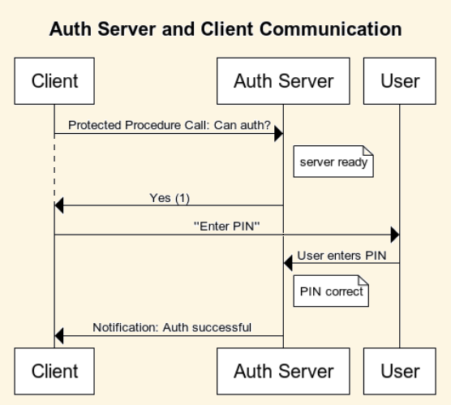

<!--
    Copyright 2023, COMAS (ABN 11 932 720 318) and the project contributors
    SPDX-License-Identifier: CC-BY-SA-4.0
-->

# The libmantle Tutorial

The purpose of this tutorial is to guide you through the process of using
libmantle to manage seL4 Core Platform abstractions. The concepts covered
include protection domains, notifications, protected procedure calls, IRQs, and
mapped memory regions.

Some familiarity with these concepts is assumed: this is not a general
introduction to the seL4 Core Platform. However, we strive to make this tutorial
accessible to programmers with varying levels of experience in using the seL4
kernel and the seL4 Core Platform abstractions.

We also assume that you know the rudiments of programming in the Austral
language, at least to the level covered in the official Austral tutorial.

## Scenario

To give you some hands-on practice, we'll consider a hypothetical scenario.
Imagine a system in a research facility, running multiple client programs or
protection domains, each with its own specialized function. Some of these
functions are sensitive and require user authorization before they can be
performed. This is not about accessing confidential data but verifying there's
a valid user initiating the request. Think of it as a controlled environment
where a scientist can initiate a sequence of complex experiments, but for
safety and compliance reasons, any critical operation requires explicit
authorization.

The system is equipped with a simple number pad for the user to input their
unique PIN when required. When authorization is needed, one of the client
programs will prompt the user to "Enter your PIN on the number pad".
This prompts the activation of another protection domain, our so-called
"authorization server". The server verifies the entered PIN and notifies
the client program about the success or failure of the authorization.

## Your mission

Your task, as the programmer, will be to implement the code for this
authorization server. To keep things simple, ou won't be working on a real seL4
Core Platform system, but a simulated environment that mirrors the behavior
of the seL4 Core Platform, mocks the client programs, simulates user
interactions, etc. This will allow you to learn and experiment with libmantle
itself, without having to configure the seL4 Core Platform build tools,
and without droping down to QEMU or getting a real PIN pad and board.

## System reference

### Number pad

Our fictitious setup includes a hardware number pad (PIN pad). This PIN pad is
an exceedingly straightforward piece of equipment, featuring a grid of 9 number
keys, ranging from 1 to 9.

The number pad converts each pressed key into its numeric value, from 1 to 9,
and "blits" this value into a designated memory-mapped input register (at
`0x5d1600`). After writing the key code, an interrupt request (IRQ 212) is
generated to notify the kernel that new input data is ready to be read.
There is no buffering of inputs; each new key press directly overwrites the
previous one in memory.

### Client-server protocol

The protocol for the communication between the client and the authorization
server starts with a protected procedure call from the client to `auth`,
checking the server's availability to handle the authorization request.

The server responds with a yes (`1`) or no (`0`), depending on its current
state (e.g. answers no if another authorization, on behalf of some other
client, is in progress). A negative response ends the exchange, while a
positive response initiates the authorization procedure.

The server then waits for the user to enter their secret PIN. If the entered
PIN matches the known PIN (in this case, `5432`), the server notifies the
client about the successful authorization.

For simiplicity, this tutorial deals with the happy path of the authorization
process only, i.e., we won't send any notifications unless  the PIN matches.

A sequence diagram depicts this happy path below:



### Project layout

This project contains several key directories and files that you'll be working
with:

* The `start` directory is where you'll be performing the tasks for this tutorial.
* The `finish` directory contains the completed code for this tutorial, which can
  be used for reference.
* The `tutorial.system` file is the SDF/XML file that defines the system
  architecture for this tutorial. You'll be making changes to it regularly.
* The `program.aum` file contains the initial Austral program that runs on your
  `auth` protection domain, and will be edited throughout this tutorial.
* The `compile` script is a simple build script. You can run it from the
  `start` directory: it runs `mantletool`, compiles your Austral code, then
  hooks the compiled `auth` to a simulator so you can test it.

## Tutorial

### Setup

Before you begin, you should:

**1. Obtain the Austral compiler.**

The only version of the Austral compiler supported by libmantle is `0.2.0`.
Make sure you have this version by executing
```bash
 $ /path/to/austral --version
 0.2.0
```
**2. Install mantle-tool**

Follow the guide in the project README. If you installed mantle-tool using
`pipx`, then executing
```bash
 $ pipx list
apps are exposed on your $PATH at /root/.local/bin
   package mantle-tool 0.1.0, installed using Python 3.9.2
       - mantletool
```
will return the message above, and `mantletool` will be in your `PATH`.

**3. Set up some environmental variables**

You need to define both the `AUSTRAL` and `MANTLE` environment variables. The
tutorial build scripts use these to find your toolchain. The `AUSTRAL` variable
should point directly to your Austral compiler, and the `MANTLE` variable
should point to the libmantle `library/` directory.

```bash
export AUSTRAL=/path/to/austral
export MANTLE=/path/to/libmantle/library/
```

**4. Enter the start directory**

With all that set up, let's navigate to `examples/tutorial/start` and begin.


### Step 1. Hello World

Let's start by inspecting our system. Open `tutorial.system`. You'll see that
the protection domain `auth` is already defined there, along with two clients.

Moreover, the `auth` protection domain contains an`irq` element:

```xml
<irq irq="212" id="0" />
```

which means that the kernel will notify our protection domain whenever IRQ 212
is active (i.e. whenever the user presses a number key on the PIN pad). The
`id="0"` field tells us that this notification will be received on channel id
zero.

Now, open `program.aum`. This file contains the three entry points we'll have
to implement. It already has some stub code set up, including a case in the
`notified` function which handles notifications from IRQ 212 on channel id 0.

We can compile the program by executing:
```bash
chmod +x compile
./compile
```

The `compile` script does the following:
1. Generate the Austral API for `auth` by running  `mantletool` on
   `tutorial.system`.
2. Compile your `program.aum` file using the Austral compiler into C code.
3. Combine this C code with the mock seL4 Core Platform headers and compile
   it to an executable that you can run on your computer.

After you run `compile`, a few new files will have appeared in the `start`
directory.

First of all, `generated.c`, `generated.aui` and `generated.aum` are the
three files generated by `mantletool` based on `tutorial.system`. They contain
the API that you import from `Mantle.Generated`, and that you use to implement
your protection domain. The interface file, `generated.aui`, lists all the
API functions and types you have available.

Next, the `target/` directory contains the compiled executable (`program.elf`)
and some temporary files created during compilation (including the `program.c`
that the Austral compiler generated).

If you run `./target/program.elf`, you'll notice that it just hangs. Let's
add something to see.

**Task:** Use `printLn(-)` to print `Hello World` in the `init` entry point,
and to print a message if an IRQ notification is received on channel id 0.

**Note:** Our simulator redirects `printLn(-)` to `stdout`. On the actual
seL4 Core Platform, `printLn(-)` compiles to a no-op.


## Step 2. Handling Protected Procedure Calls

The protocol for the communication between the client and the authorization
server starts with a protected procedure call from the client to `auth`,
checking the server's availability to handle the authorization request.

To receive protected procedure calls from the clients, we'll need to create a
`channel` connecting the `auth` domain to the client. You can create such a
channel by adding the following to `tutorial.system`:

```xml
<channel>
    <end pd="auth" id="1" />
    <end pd="client1" id="42" />
</channel>
```

This sets up a channel that lets `client` send a notification or make a
protected procedure call to `auth`s channel id 1. Vice versa, by sending a
notification on channel id 1, `auth` will be able to notify `client`'s
channel 42.

**Note:** The simulator does not care about which channel `id` you use for the
client. Feel free to use any valid channel id between 0 and 63.

If you try to `compile` your program now, you will get the following error:

```
Title: Type Error
Module:
  Program
Location:
  Filename: 'program.aum'
  From: line 22, column 8
  To: line 31, column 17
Description:
  Non-exhaustive case statement.
Code:
  20 | 
  21 | function notified(cap: MantleUserCap, mem: MemoryCaps, source: NotificationSource): Unit is
  22 |   case source of
  23 |     when Ch00(irq: Ch00Irq) do
  24 |       -- handle IRQ here
  25 |       postpone(irq);
  26 |     when UnknownNotification(number: Nat32) do
  27 |       -- we hang if we receive an unknown notification
  28 |       while true do
  29 |          skip;
  30 |       end while;
  31 |   end case;
  32 |   surrender(mem);
  33 |   surrender(cap);
```

What happened? Well, we added a new channel, and mantle-tool regenerated the
API for us. If you inspect `generated.aui`, you'll see that new constructors
appeared for the `NotificationSource` type:

```ada
union NotificationSource: Linear is
   case Ch00 is
       irq: Ch00Irq;
   case Ch01;               -- <- new!
   case UnknownNotification is
       number: Nat32;
end;
```

Our current code handles only two of these cases, `Ch00` (for the IRQ) and
`UnknownNotification`. Now we need to handle channel id 1 (`Ch01`) as well!

You can handle it by inserting a new `when` branch to the case statement:
```ada
when Ch01() do
  -- handle notifications on ch 1
```

Similarly, our `protected` entry point handled only the `UnknownPpcall`
source. But we see in `generated.aui` that a new constructor also appeared for
the `PpcallSource` type:

```ada
union PpcallSource: Linear is
   case FromCh01;           -- <- new!
   case UnknownPpcall is
       number: Nat64;
end;
```

So we'll need a new case for `FromCh01()` in protected to handle protected
procedure calls from channel id 1 as well.

**Task:** Edit `program.aum` so that it prints out a message when you get a
notification or protected procedure call from channel id 1.

When you run the program, you will see an incoming protected procedure call
on channel 1.

**Task:** Add another channel, connecting channel id 2 of `auth` to
`client2`. Get the program into a compiling state again.


## Step 3. Handling IRQs

Now that we can receive notifications and protected procedure calls from the
clients, it's time to start answering them. To respond to a protected
procedure call, we have to return a `MessageInfo` structure from `protected`.

```ada
record MessageInfo: Free is
    label: Nat64;
    count: Nat16;
end;
```

The `label` field of the returned `MessageInfo` is not parsed by the kernel in
any way, so can be used to encode a return value that the calling protection
domain will receive. In accordance with the protocol specified above, we
will set the label to `1` if the auth server is ready to obtain authorization
for the client via the PIN pad, and `0` if the auth server is busy (e.g.
currently handling authorization for another client).

The `count` represents the message length. It determines the number of message
registers that the kernel will transmit to the caller protection domain. We
won't be using message registers in this tutorial, so we will set `count` to
zero throughout.

For now, we won't worry about having busy status: we'll just answer `1` to
every request.

**Task:** Return `label => 1` to the ppcall made by the first client.

If you run the program now, you'll see the terminal notifying you of an IRQ.
What's going on?

Well, once you respond to `client1` that you're ready to perform the
authorization, the client will tell the user to type their PIN on the PIN pad.
And one the user starts typing the PIN, an IRQ is generated, which the `auth`
protection domain receives as a notification on channel id 0.

When you receive an IRQ notification, the interrupt is masked. This means that
further interrupt requests will not be generated, until you explicitly
acknowledge to the kernel that the IRQ has been handled. This will "unmask" the
interrupt, allowing further notifications to be delivered.

**Task:** Use the `acknowledge` method to acknowledge the IRQ.

**Note:** Currently, acknowledging the interrupt is `postpone`d. However,
you cannot both `postpone` and `acknowledge` the interrupt at the same time:
Austral's linear type system ensures that either action will consume the
`Ch01Irq` capability. What happens if you neither `acknowledge` nor `postpone`
an IRQ capability?

If you are successful, you will see 4 IRQ notifications happening after a
short delay: this is the user typing the 4-digit PIN.


## Step 4. Reading memory

Recall that the number pad converts each pressed key into its numeric value,
from 1 to 9, and "blits" this value into a designated memory-mapped input
register (at `0x5d1600`) before the interrupt request is generated.

Now that we're getting the IRQ notifications, we should try to read the input
register in memory and use it to determine which number key the user pressed.

The `tutorial.system` file already maps this register into the virtual address
space of the `auth` protection domain, thanks to the following lines:
```xml
<map mr="pinpad_input_reg" setvar_vaddr="pinpad_input"
             vaddr="0x2_000_000" perms="r" cached="false" />
```

Inspecting `generated.aui`, you will see that a memory capability has been
generated for the `pinpad_input` memory region in the `MemoryCaps` record:

```ada
    record MemoryCaps: Linear is
       pinpadInput: PinpadInputRCap;
    end;
```

Since the memory is mapped read-only, the record contains an `RCap` for
this region.

The system hands each of our entry points the `mem: MemoryCaps` argument, which
lets `auth` read its mapped memory regions. We will need to read `pinpadInput`
from the `Ch00(irq: Ch00Irq)` case of the `notified` entry point, and print
the value of the memory-mapped input register.

Currently, `notified` throws away its `mem: MemoryCaps` structure using the
`surrender` method. Instead of surrendering this linear structure, we will have
to destructure it to gain access to the `pinpadInput` field. You can accomplish
this using a destructuring assignment:

```ada
let { pinpadInput: PinpadInputRCap } := mem;
-- ... use pinpadInput here ...
surrender(pinpadInput);
```

**Hint:** You will have to import the type `PinpadInputRCap` from the
`Mantle.Generated` module!

Now that we have access to the `pinpadInput` field, we need to obtain a
read-only reference to the memory it encapsulates. To obtain such a reference
we can use the `toSpan` method defined in the `Readable` type class of
`Mantle.Common`:

```ada
generic [R: Region]
method toSpan(object: &[PinpadInputRCap,R]): Span[Nat8, R];
```

The `toSpan` method does not consume the capability: it takes a reference
to the capability instead. This means that you can create multiple read-only
`Span`s to the memory region using a single `PinpadInputRCap`.

However, when you write

```ada
let input: Span[Nat8, R] := toSpan(&pinpadInput);
```

you encounter the following compiler error:

```
Error:
  Title: Type Error
  Description:
    Unable to find a type with the name `R`.    
    Consider importing it, if it is defined in another module.
  Code:
    26 | let register: Span[Nat8, R] := toSpan(&pinpadInput);
```

What's happening? Well, references and arrays (`Span`s) in Austral are
specific to a region, and the `toSpan` method is defined to work generically
over any region `[R: Region]`. The letter `R` here denotes a type variable.

The `&pinpadInput` syntax is a shorthand provided by Austral that creates a
reference to `pinpadInput` in an anonymous region: consequently, we have no way
to refer to this region in the type declaration of `input`. The compiler
complains that the name `R` is not defined.

Instead of using the `&pinpadInput` shorthand to create a reference, we have to
use the full-fledged `borrow` syntax to create a reference while naming the
region. One can do this as follows:

```ada
borrow pi: &[PinpadInputRCap, R] := &pinpadInput do
  let input: Span[Nat8, R] := toSpan(pi);
  -- use input
end borrow;
```

**Task:** Print the value in the input register whenever a `Ch00` notification
is received.

If you succeed, you will see the numbers `5,4,3,2` printed in your terminal.


## Step 5. Writing memory

We're getting close: now, we must verify that the user entered the correct
PIN, and notify the correct client.

To do this, `auth` has to remember a couple of things:

* Which digits did the user enter?
* Who is the current client?

If you were building `auth` in C, you'd probably store these in global
variables. Things are not quite so simple in Austral and libmantle.

Austral has no global variables, nor mutable function arguments. Moreover,
the libmantle entry points do not allow you to thread state through them
(by getting your previous state as an argument and returning a new state).
If libmantle permitted you to do this, you could use it to duplicate certain
caps which you are not allowed to mint, such as elements of the `MemoryCaps`
structure or the `Ch00Irq`.

**Note:** Keep in mind that this is version 0.1.0. The API is ever-changing,
and we have reason to think that future versions might allow you to thread
local state through in a safe way. See the manual for more information.

Instead, we will simply use a mapped memory region to store the state of our
protection domain. Let's create a new memory region in `tutorial.system`:

```xml
<memory_region name="auth_local_state" size="0x1_000" />
```

To map this new region into the `auth` protection domain, add the following
inside its element:

```xml
<map mr="auth_local_state" setvar_vaddr="local_state"
     vaddr="0x3_000_000" perms="rw" cached="true" />
```

Recompiling your program will give you the following error message:

```
Title: Type Error
Module:
  Program
Description:
  The set of slots mentioned differs from the set of slots in `MemoryCaps`
Code:
  26 | let { pinpadInput : PinpadInputRCap } := mem;
```

What's happening? Well, if you inspect `generated.aui`, you'll see that
the `MemoryCaps` type has changed:

```ada
record MemoryCaps: Linear is
   localState: LocalStateRWCap;
   pinpadInput: PinpadInputRCap;
end;
```

Apart from the `pinpadInput`, the record now has a field for the `localState`
memory region as well. Since we mapped this region with a read-write permission
in `tutorial.system`, the capability is an `RWCap`.

The error message is telling us that we need to update our destrucuring
assignment of `mem` to account for this new field. We can do this as follows:

```ada
let { localState: LocalStateRWCap
    , pinpadInput : PinpadInputRCap } := mem;
```

**Hint:** You will have to import the type `LocalStateRWCap` from the
`Mantle.Generated` module!

At this stage, you might get the following error message:

```
  Title: Linearity Error
  Module:
    Program
  Description:
    Forgot to consume a linear variable: `localState`.
  Code:
    26 | let { localState: LocalStateRWCap
    27 |     , pinpadInput : PinpadInputRCap } := mem;
```

This is the linearity checker telling us that we should either consume this
capability somewhere, or `surrender` it explicitly.

The `RWCap`s instantiate the `Writable` type class from `Mantle.Common`,
allowing us to invoke the `toSpanWrite` method:

```ada
generic [R: Region]
method toSpanWrite(object: Cap): Span![Nat8, R];
```

Notice that, unlike `toSpan`, this method consumes the associated capability,
thereby ensuring that you only have one mutable reference to your mapped
memory region.

**Note:** This restriction is subject to change in future versions; since the
`Nat8` type can be updated atomically, most benefits of the "one mutable ref"
restriction don't apply here. However, this restriction still might be
necessary for programmers implementing safe abstractions on top of the
low-level ones provided by libmantle. The raison d'etre of libmantle is
precisely to serve as a platform for experiments with linearly-typed API design
for the seL4 Core Platform and beyond.

To create a mutable array from the capability, you can use e.g.
```ada
var local: Span![Nat8, Static] := toSpanWrite(localState);
local[1] := 42;
```

Let's invent a memory layout for our local state. The rest of the tutorial will
assume the following, very dense layout, but you are welcome to experiment with
others, including loading/saving an actual `record` onto the local state memory
region.

```
local[0]
  --^ the number of the client we're currently serving, 0 if none
local[1]
  --^ the number of digits entered by the user in the current session
local[2]
  --^ 0 if all the digits entered so far were correct, 1 otherwise
```

**Task:** Implement local state updates in the `notified` and `protected`
entry points. Change the behavior of `protected` to return `1` only if
the local state indicates that we're not already handling a different
client.


## Step 6. Sending notifications

One last thing left to do: actually notify the client when the authorization
process is finished.

For simplicity, we only care about the happy path in this tutorial: if the
authorization was successful, we send a notification; but if it was not 
successful, we won't send a notification at all.

In a real scenario, there would be a shared memory region between the client
and the `auth` server, where the server would write a message with the outcome
of the authorization, and possibly release some kind of token for the client,
without ever revealing the PIN to it.

To send a notification on a channel, we need a capability for the channel.
Fortunately, the system hands each entry point a capability of type
`cap: MantleUserCap`, and this capability can be used to mint capabilities
to each of the channels.

For example, to mint a capability to channel id 1, a `Ch01Cap`, we can use
the function

```ada
generic [R: Region]
function mintCh01(cap: &[MantleUserCap, R]): Ch01Cap;
```

from the `Mantle.Generated` module. This capability instantiates the
`Notifiable` type class, so once we have it, we can call the `notify` method

```ada
generic [R:Region]
method notify(cap: &[Cap,R]): Unit;
```

to send a notification to the other end of channel id 1.


**Task:** Modify the `notified` IRQ handler to send a notification to
the current client upon a successful authorization. Reset the local state
upon an unsuccessful authorization.

If you succeed, you should receive the following final sequence of events
when running the program:

```
auth prints: Hello World!
ppcall on ch 1
notification on ch 0
auth prints: 5
notification on ch 0
auth prints: 4
notification on ch 0
auth prints: 3
notification on ch 0
auth prints: 2
ppcall on ch 2
ppcall on ch 1
notification on ch 0
auth prints: 5
ppcall on ch 1
notification on ch 0
auth prints: 4
ppcall on ch 1
notification on ch 0
auth prints: 3
ppcall on ch 1
notification on ch 0
auth prints: 2
```

If you're getting this sequence of events, then congratulations, you have
successfully completed the libmantle tutorial.
